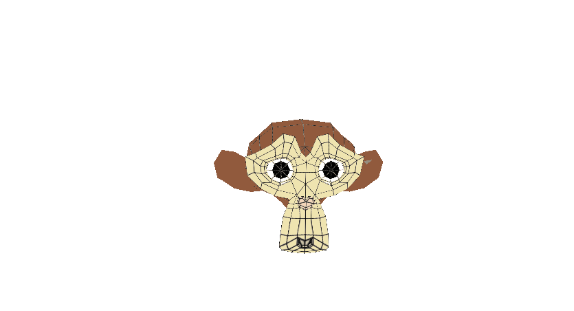

# Módulo Trajetória

## Instruções de Execução

- Configure o Visual Studio para executar em x86

- Abra o arquivo .sln

- Aperte o botão play na IDE

## Resultado

Abaixo está um gif do Módulo Trajetória sendo executado. A câmera é controlada pelo mouse e pode se afastar ou se aproximar, além de se mover para direita e esquerda com comandos do teclado. A suzanne segue uma trajetória definida na tela

Essa atividade foi realizada para a Tarefa M6 - Definindo trajetórias para alguns objetos

